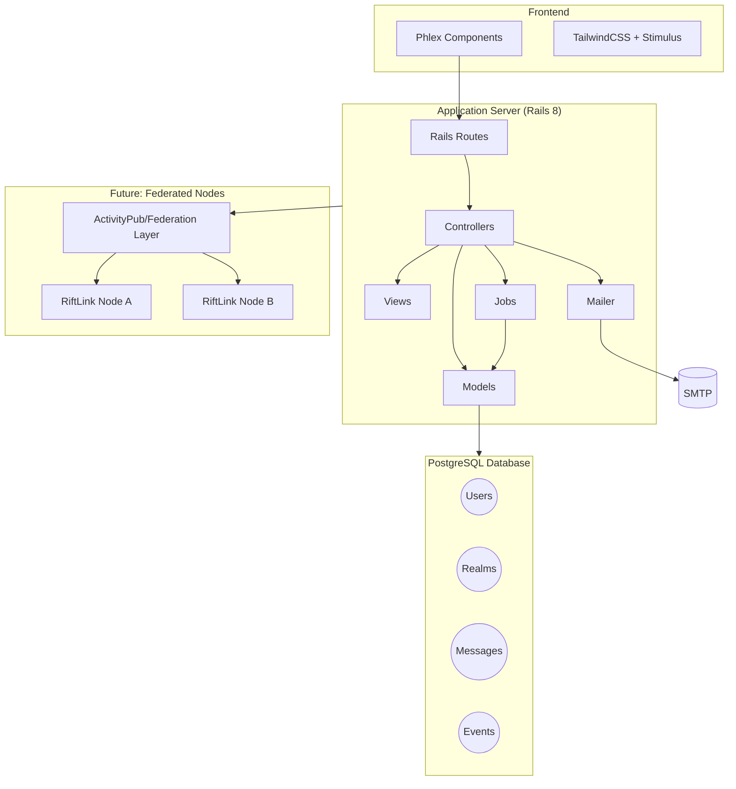

# 🎮 RiftLink

**RiftLink** is a social platform designed for gamers to connect, communicate, and coordinate across shared interest spaces called _realms_. Built on **Rails 8** with a future-facing goal of **decentralization**, RiftLink aims to empower player communities with flexible tools for messaging, events, and identity.

---

## 📸 Screenshots


---

## 🤩 Features

- 🔐 Authentication (email verification, password resets, session management)
- 🏰 Realms – user-created communities with channels and members
- 💬 Messaging – channel-based and direct messages
- 🗕 Events – planning and RSVP tools
- 👥 Friend system – friend requests, status tracking
- 🕎 Notifications and activity feed
- 🧠 Component-based frontend with **Phlex**
- 🎨 TailwindCSS & Stimulus for UI interactivity
- ⚙️ Designed for future decentralization (identity, realms, sessions)

---

## 🛠 Tech Stack

- **Backend:** Ruby on Rails 8
- **Views:** [Phlex](https://phlex.fun)
- **Frontend:** TailwindCSS, StimulusJS
- **JS Bundler:** Vite
- **Email:** ActionMailer
- **Testing:** Rails Test Framework
- **CI:** GitHub Actions
- **Containerization:** Docker

---

## 🗄 Architecture Overview



---

## 🥪 Development Setup

```bash
git clone https://github.com/your-org/riftlink.git
cd riftlink
cp .env.sample .env
bundle install
yarn install
bin/setup
rails db:setup
```

Start the app locally:

```bash
bin/dev
```

---

## 📂 Key Directories

- `app/components/` – UI components built with Phlex
- `app/models/` – Domain logic for users, realms, messages, events, etc.
- `app/controllers/` – REST endpoints and interactions
- `app/views/` – Phlex view templates
- `app/mailers/` – Email templates and delivery
- `config/` – Application, routes, and service configuration

---

## 🎯 Vision

RiftLink is designed with decentralization in mind. As the project evolves, we plan to:

- Support **self-hosted realms**
- Explore **federated identity and messaging**
- Align with open standards like **ActivityPub**

---

## 📜 License

MIT License © 2025 RiftLink Contributors
